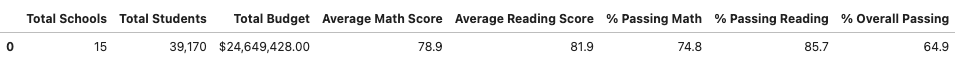
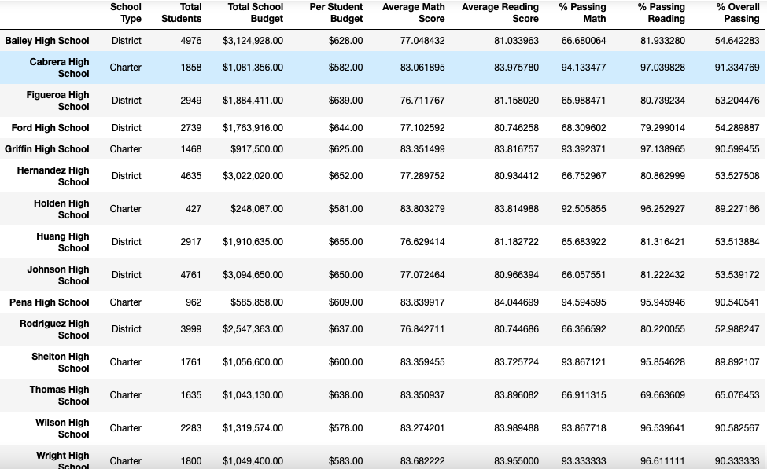
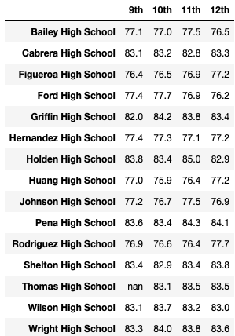
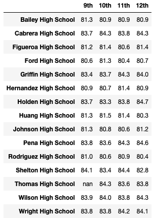
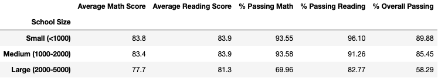

# School_District_Analysis

## Overview_of_the_School_District_Analysis
The purpose of this analysis was to get an overview of fifteen different schools. It was shown in the data that there was academic dishonesty for the reading and math grades of Thomas High School ninth graders. The new data removed this skewed data for more accurate results.

## Results
- District Summary saw the overall percentage go down one percent

- School Summary saw the passing percentage go down significantly

- Thomas High School went from the top of the list to the bottom causing the other schools to change and escalate their own positions.

- Ninth Grade Scores Affects

  - Math and Reading Scores by grade 
    In this data you will see the most visible change made to the data the original high percentages have all been removed for 9th graders.
      
  Math
     

  Reading
    

  - Scores by school spending
    In this data set you will see 
    

  - Scores by school size

  

  - Scores by school type
 
  

## Summary
The biggest change to happen to the data was that the math and reading scores for Thomas High School have been replaced with NaN. This also changed Thomas High schools overall passing percentage it went 91% and dropped significantly to 65%. The skewed data from ninth grade allowed to it to be one of the top schools but after fixing the data it is seen as one of the lowest. This of course allowed most other schools to move up in position.
