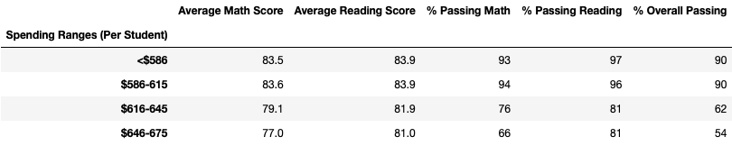

# School_District_Analysis

##Overview_of_the_School_District_Analysis
The purpose of this analysis was to get an overview of fifteen different schools. It was shown in the data that there was academic dishonesty for the reading and math grades of Thomas High School ninth graders. The new data removed this skewed data for more accurate results.

##Results
- District Summary was not affected by these results

- School Summary saw the passing percentage go down significantly

- Thomas High School went from the top of the list to the bottom causing the other schools to change and escalate their own positions.

- Ninth Grade Scores Affects
  - Math and Reading Scores by grade 

  - Scores by school spending

  - Scores by school size

  - Scores by school type

##Summary
The biggest change to happen to the data was that the math and reading scores for Thomas High School have been replaced with NaN. This also changed Thomas High schools passing percentage for all categories.
